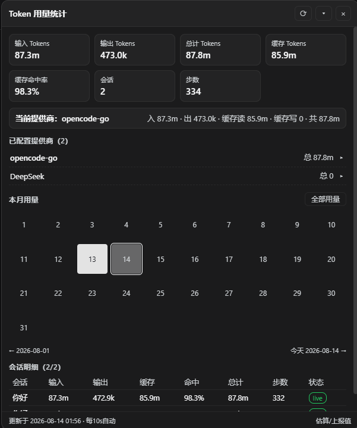
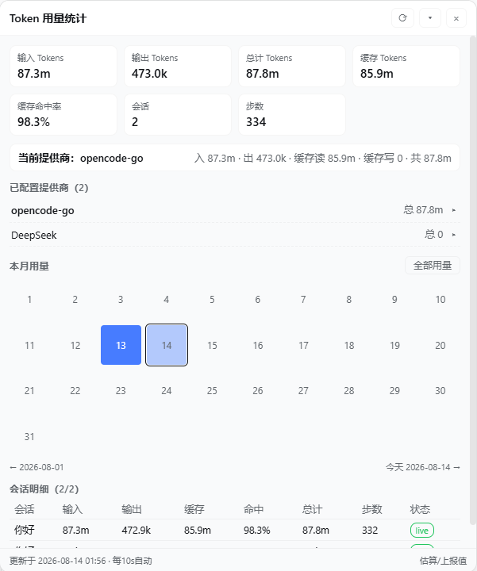
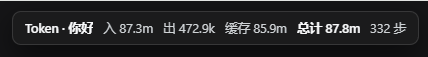
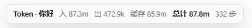

[简体中文](README.md) | English

# dsh-512-token

A floating token usage statistics panel for the [DeepSeek Harness](https://github.com/deepseek-ai/deepseek-harness) v0.1.7-rc.1 Web interface. After installation, a draggable overlay appears in the bottom-right corner, displaying real-time input / output / cache / hit rate, per-provider and per-model usage breakdowns, a current-month daily heatmap, and per-session request-level records.

<table>
  <tr>
    <td></td>
    <td></td>
  </tr>
  <tr>
    <td></td>
    <td></td>
  </tr>
</table>

## Features

- **Total Overview**: Input, output, total, cache read / write, cache hit rate, session count, step count
- **Current Session Provider**: Automatically highlights the provider used by the current session with its cumulative usage
- **Provider Breakdown**: Only shows providers you actually configured (from `llm-pi-ai` / `llm-deepseek` settings) plus routes that produced usage; click to expand per-model usage details
- **Monthly Heatmap**: Daily usage squares for the current month (darker = more usage in dark mode, bluer = more in light mode); click any date to switch the entire panel to that day's data, click "All Usage" to return to the full view
- **Session Details**: Per-session input / output / cache / hit rate / total / steps; expand to view bucketed stats, context pressure, and recent per-request records (time, provider / model, input, output, cache read, cache write)
- **Panel Interaction**: Draggable, collapsible into a summary bar, reopen from a floating ball after closing
- **Auto Refresh**: Data refreshes every 10 seconds; color scheme follows Harness light / dark theme

## Installation

```bash
dsh plugin --profile web add github:omsd512-W/dsh-512-token
```

The package contributes its own `cordis.patch.yml` bundle layer. Restart dsh and refresh the page after installation.

### Install from Source

```bash
git clone https://github.com/omsd512-W/dsh-512-token.git
cd dsh-512-token
dsh plugin --profile web add .
```

## Uninstall

Run `dsh plugin --profile web remove dsh-512-token`, then restart dsh.

## How It Works

```
lib/index.js       Host half: incrementally folds session logs, aggregates stats, serves via HTTP route /dsh-512-token
lib/client.js      Browser half: panel UI (shell module-table format, no build step)
cordis.patch.yml   Bundle layer loaded by the dsh plugin manager
```

**Data Source**: Harness `tokenUsage` / `sessionStats` projections (provider-reported values) combined with the plugin's incremental fold of session logs (`request/header` + `assistant/message` / `assistant/attempt` usage). Live sessions use consistent `sessionQuery.observeSession` snapshots; archived sessions are folded once and cached.

**Plugin Loading Contract**:

- `package.json` declares `dsh.client.platform = "web"` and `inject` dependencies; the host scanner generates `window.__DSH_BOOT__` graph rows and mounts the `/plugins/<id>/client.js` route
- The browser half is bundled in module-table format; the factory returns `{ apply, inject }`, service dependencies follow the exported `inject`
- UI entry injected via `ctx.slots.inject('shell.overlay', …)` as a root-scope overlay
- Hot reload boundary: `lib/client.js` changes take effect on page refresh; `dsh.client` declaration changes require a dsh restart

## Development

```bash
# Syntax check
npm run check

# Install this checkout into the web profile
dsh plugin --profile web add .
```

## Source & License

This fork adapts **H1a3x**'s `dsh-token-stats` to DeepSeek Harness v0.1.7-rc.1 and retains the original [MIT](LICENSE) license and attribution.

- Repository: https://github.com/H1a3x/dsh-token-stats
- npm: https://www.npmjs.com/package/dsh-token-stats

Third-party code must retain its original LICENSE and attribution; active third-party dependencies with upstream should be referenced via npm dependencies, not copied.

## Links

- [Linux.do](https://linux.do/)
