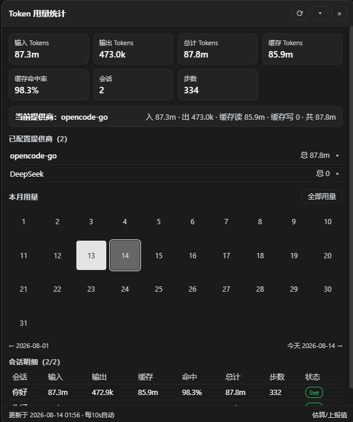
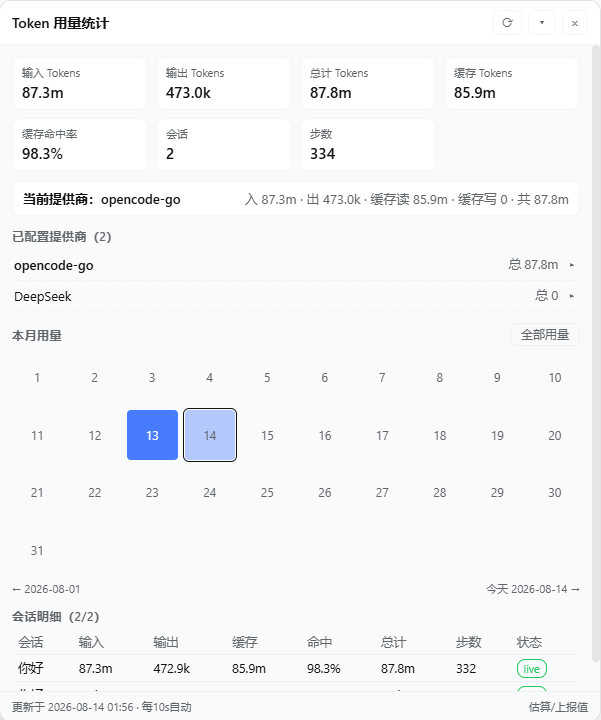

简体中文 | [English](README.en.md)

# dsh-512-token

为 [DeepSeek Harness](https://github.com/deepseek-ai/deepseek-harness) v0.2.0-rc.1 Web 界面提供 Token 用量统计页。安装后在 **设置 → Token 用量** 中查看全部会话的输入 / 输出 / 缓存 / 命中率、按提供商与模型的用量明细、当月每日热力图，以及会话级逐请求记录。

<table>
  <tr>
    <td></td>
    <td></td>
  </tr>
</table>

> 截图为 0.3 版浮窗，0.4 起同样的内容显示在设置页中。

## 功能

- **总用量概览**：输入、输出、总计、缓存读取 / 写入、缓存命中率、会话数、步数、轮次
- **统计全部会话**：包括历史会话、fork 会话和子代理会话，没有数量上限
- **提供商明细**：显示你配置的提供商（来自 `llm-pi-ai` / `llm-deepseek` 设置节）及产生过用量的路由；点击展开可查看每个模型的用量
- **本月热力图**：当月 1 号至月末的每日用量方格；点击任意日期，整页切换为该日数据，点「全部用量」返回
- **会话明细**：每个会话的输入 / 输出 / 缓存 / 命中率 / 总计 / 步数，展开可查看分桶统计、上下文占用、fork 继承情况与最近逐请求记录
- **fork 只计一次**：fork 出来的会话只计 fork 之后自己的用量，从原会话继承的部分已计入原会话；原会话被删除时，继承部分计入 fork 会话一次
- **跟随界面**：语言跟随 dsh 的中英文设置，配色跟随深浅主题；设置页打开时每 10 秒刷新

## 安装

```bash
dsh plugin --profile web add github:omsd512-W/dsh-512-token
```

插件自带 `cordis.patch.yml` 组合层，`dsh plugin` 会把它加入 `web` profile。完成后重启 dsh 并刷新页面。

需要 dsh 0.2.0-rc.1 或同一 0.2 系列的更新版本（依赖其会话投影接口）；版本不匹配时 dsh 会停用本插件，而不是让它出错。

### 从源码本地安装

```bash
git clone https://github.com/omsd512-W/dsh-512-token.git
cd dsh-512-token
dsh plugin --profile web add .
```

## 卸载

运行 `dsh plugin --profile web remove dsh-512-token`，然后重启 dsh。可以一并删除 `~/.dsh/storages/dsh-512-token/`。

## 工作原理

```
lib/index.js       宿主半：注册会话投影，读取投影缓存，通过 HTTP 路由 /dsh-512-token 提供数据
lib/client.js      浏览器半：设置页 UI（shell module-table 格式，无需构建步骤）
cordis.patch.yml   dsh 插件管理器加载的组合行
```

**增量统计**：每个会话的用量是一个 dsh 会话投影（`sessionProjections`，只在宿主端，不随会话数据发往浏览器）。

- 运行中的会话：dsh 每追加一条事件就更新一次投影，插件直接读取当前值。
- 历史会话：dsh 在每轮结束、会话关闭时把投影写入持久缓存（`sessionProjectionCache`），插件直接读缓存，不读日志。
- 没有缓存的会话（首次安装、统计逻辑升级后）在后台完整读取一次，结果写回缓存，以后不再重读。
- 缓存可能落后于日志（例如 dsh 在一轮中途被强制关闭，或会话在另一个 profile 中继续过）。插件在 `~/.dsh/storages/dsh-512-token/verified.json` 记录每个缓存值核对时的日志大小；日志大小变化时，先显示缓存值，同时在后台重新读取这一个会话。

**数据口径**：用量取自日志里模型上报的值（`request/header` 确定提供商与模型，`assistant/message` / `assistant/attempt` 的 usage），同一步里的重试按 dsh token-meter 的替换规则只计最终一次。fork 会话继承的前缀长度由 dsh 直接提供（inheritedEventCount），旧格式日志则按 `session/end-seed { inherited: true }` 标记分界。

**插件装载契约**：

- `package.json` 声明 `dsh.client.platform = "web"` 及 `inject` 依赖，宿主扫描器据此挂载 `/plugins/<id>/client.js`
- 浏览器半以模块表格式打包，工厂返回 `{ apply, inject }`
- UI 通过 `ctx.slots.inject('settings.section', …)` 注册为设置页（id `dsh-512-token`，排在内置页面之后）
- 修改统计逻辑时递增 `lib/index.js` 中的 `STATE_VERSION`，旧缓存自动失效并在后台重建

## 开发

```bash
# 语法检查与测试
npm run check

# 从当前目录安装到 web profile
dsh plugin --profile web add .
```

## 来源与版权

本项目基于作者 **H1a3x** 的 `dsh-token-stats`；沿用 [MIT](LICENSE) 许可证并保留原作者署名。

- 源码仓库：https://github.com/H1a3x/dsh-token-stats
- npm 包：https://www.npmjs.com/package/dsh-token-stats

迁入第三方代码必须保留原 LICENSE 与署名；活跃且有上游的第三方依赖优先通过 npm 依赖引用，不搬代码。

## 友情链接

- [Linux.do](https://linux.do/)
